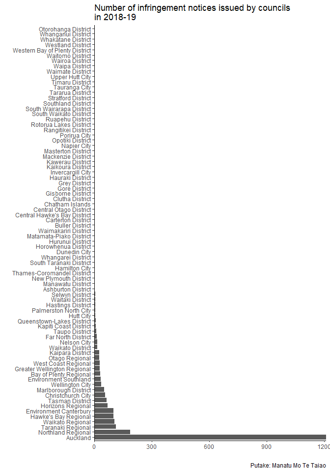

<!-- README.md is generated from README.Rmd. Please edit that file -->

# reohelpers

<!-- badges: start -->
<!-- badges: end -->

The goal of reohelpers is to make te reo easier to use in R.

## Installation

reohelpers is not yet released on [CRAN](https://CRAN.R-project.org) but
you can install the development version from
[GitHub](https://github.com/) with:

``` r
# install.packages("devtools")
devtools::install_github("joevalalipin/reohelpers")
```

## Overview

-   `add_macron()` adds macrons appropriately to vowels in te reo words
    or phrases.
-   `macron_vowel()` adds macrons to single or multiple vowels in a
    given string.
-   `meaning()` returns a dataframe of meanings of each word in a given
    string.

## Examples

### add\_macron()

Usually the data comes without macron accents

``` r
infringements <- read_csv("data/infringements.csv")
#> 
#> -- Column specification --------------------------------------------------------
#> cols(
#>   Council = col_character(),
#>   `Council type` = col_character(),
#>   `Infringement notices` = col_double()
#> )
infringements %>% 
  ggplot(aes(x = `Infringement notices`, y = reorder(Council, -`Infringement notices`))) +
  geom_col() +
  labs(title = "Number of infringement notices issued by councils\nin 2018-19",
       x = "",
       y = "",
       caption = "Putake: Manatu Mo Te Taiao") +
  scale_x_continuous(expand = c(0, 0)) +
  theme_classic()
#> Warning: Removed 1 rows containing missing values (position_stack).
```



Using the function would add appropriate macrons to place names and
words

``` r
infringements %>% 
  mutate(Council = add_macron(Council)) %>% 
  ggplot(aes(x = `Infringement notices`, y = reorder(Council, -`Infringement notices`))) +
  geom_col() +
  labs(title = "Number of infringement notices issued by councils\nin 2018-19",
       x = "",
       y = "",
       caption = paste0(add_macron("Putake"), ": Ministry for the Environment")) +
  scale_x_continuous(expand = c(0, 0)) +
  theme_classic()
#> Warning: Removed 1 rows containing missing values (position_stack).
```


### macron\_vowel()

If for any reason you need to add macron to a specific character in a
string:

``` r
macron_vowel("a")
#> [1] "a"
```

### meaning()

A quick way to get the meaning of te reo words.

``` r
meaning("reo")
#>   word         meaning
#> 1  reo language, voice
```

Not advised for phrases but it gives you the idea.

``` r
meaning("kia ora")
#>   word                                                            meaning
#> 1  kia Various uses, meanings. Often not translatable by an English word.
#> 2  ora                                         alive, well, healthy, safe
```
